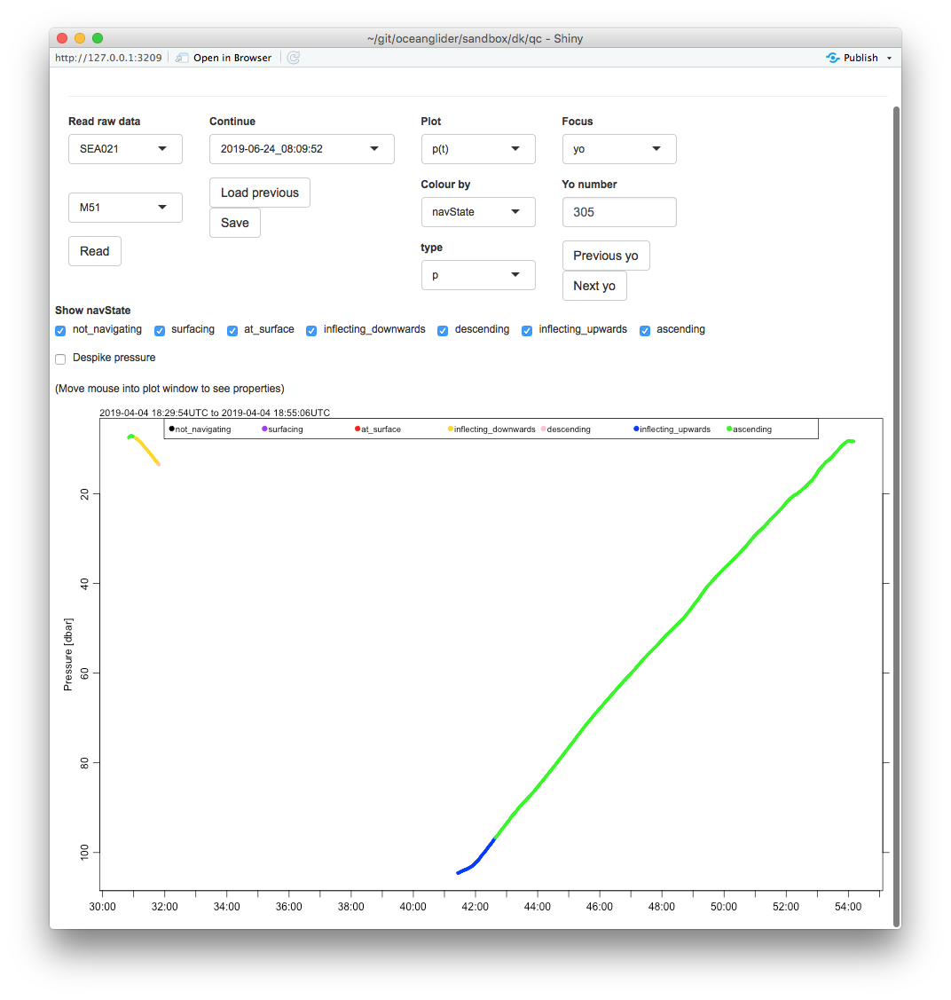

Clark, don’t shoot me for being stupid, but I'm adding some new things to my QC app, and wanted to double-check something on power on/off status.  The figure shows $p(t)$ for SEA21 M51, colour-coded by navState (sorry for small font … this app is in flux and I’m focussing on getting the action to be useful, not on the aesthetics).

**Question.** Am I right in thinking that power was turned off at about minute 31.5 or so, and then turned back on at minute 41.3 or so?  (I want to know this because I’m going to put in a thing where you can flag data for $N$ seconds after power-on.)

PS. it seems pretty clear that the S goes nuts when at the surface, so I will also likely add a QC button to remove at-surface values.  The trick is that it cannot be done just by navState because sometimes when it’s up there the state flicks back and forth between several values, like a bobsledder going back and forth before taking off. I will likely add a button/slider to remove the top N metres of the water column … after all, adding a button doesn’t say you have to click the button, but my feeling is that near-surface S will only be good if it’s actually rising after being in deep water for a minute or so … the navState alone is not good enough.

